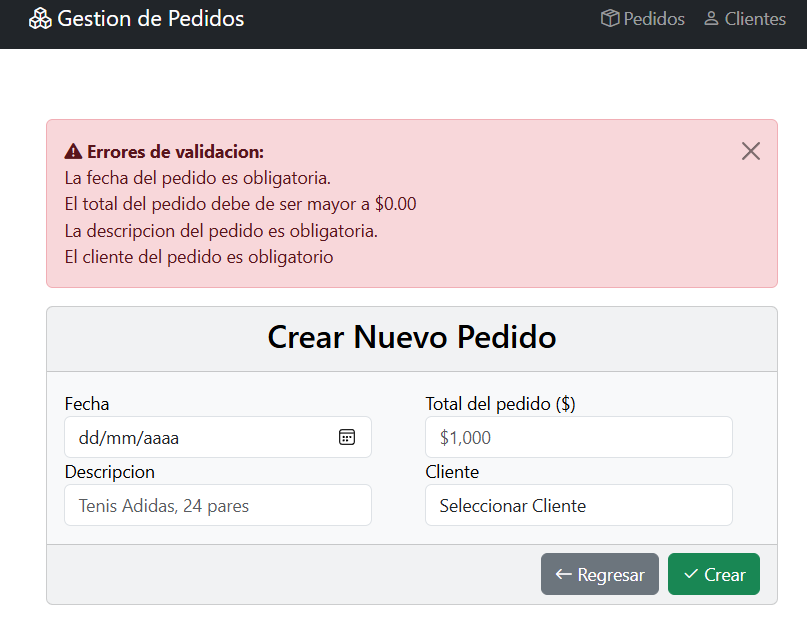
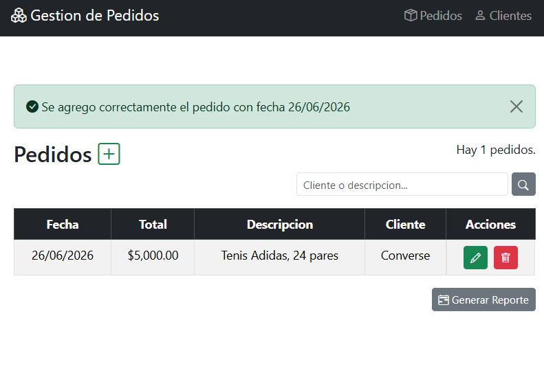
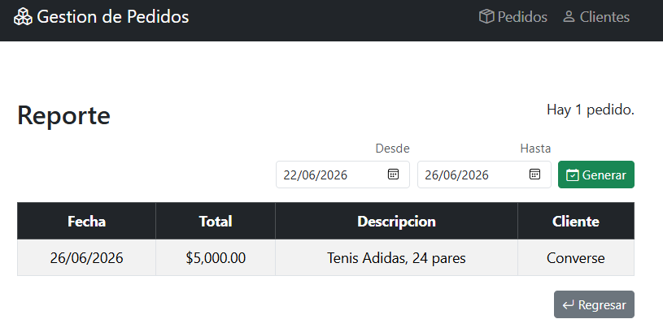
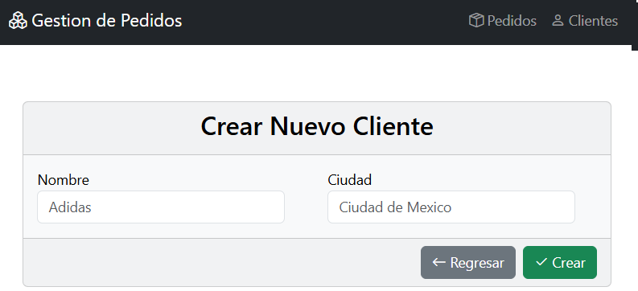
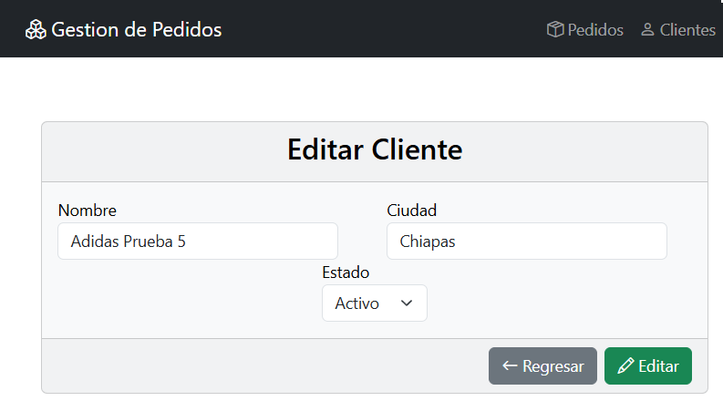

# Gestor de Pedidos - MVC

Sistema de gestión de pedidos desarrollado con **ASP.NET MVC 5** y **Entity Framework 6**.

---

## Tecnologías

- **Framework:** ASP.NET MVC 5 (.NET Framework 4.8.1)
- **ORM:** Entity Framework 6 (Database First)
- **Base de datos:** SQL Server
- **Frontend:** Bootstrap 5, HTML, CSS, JavaScript
- **Lenguaje:** C#

---

## Funcionalidades

- $\checkmark$ CRUD completo de Clientes.
- $\checkmark$ CRUD completo de Pedidos.
- $\checkmark$ Búsqueda de clientes por nombre o ciudad.
- $\checkmark$ Validaciones en capa de negocio.
- $\checkmark$ Reportes de pedidos.
- $\checkmark$ Interfaz moderna con Bootstrap 5.
- $\checkmark$ Manejo de errores y validaciones.

---

## Instalación

### Requisitos previos

- Visual Studio 2019 o superior.
- SQL Server.
- .NET Framework 4.8.1

### Configuración de la Base de Datos

Antes de iniciar la aplicación, debes crear la base de datos ejecutando el script proporcionado:

1. Abre **SQL Server Management Studio (SSMS)**.
2. Conéctate a tu servidor local de SQL Server.
3. Ve a **File > Open > File...** (o presiona `Ctrl + O`) y selecciona el archivo `PedidosClientes.sql`.
4. Asegúrate de que no haya ningún texto seleccionado.
5. Haz clic en el botón **Execute** en la barra de herramientas (o presiona **F5**).

### Pasos para ejecutar el proyecto

**1. Clonar el repositorio**

`git clone https://github.com/brandon13-dev/Gestor-Pedidos-MVC.git`

**2. Abrir el proyecto**

Abre el archivo `SolWebPedidosEF.slnx` en Visual Studio.

**3. Configura las credenciales**

El proyecto utiliza EF con conexion a SQL Server.

**IMPORTANTE:** El archivo `Web.config` contiene credenciales reales y NO está subido al repositorio por seguridad.

Para configurar el entorno:

# Copia la plantilla de configuración

`cp WebPedidosEF/Web.config.template WebPedidosEF/Web.config`

Luego edita `WebPedidosEF/Web.config` y reemplaza los placeholders con tus credenciales dentro de la etiqueta `<connectionStrings>` (data source, initial catalog, user id, password).

**4. Restaurar paquetes NuGet**

Visual Studio restaurará automáticamente los paquetes necesarios. Si no, ejecuta:

`Update-Package -reinstall`

**5. Ejecuta el proyecto**

- Presiona `F5` para ejecutar en modo depuración.
- El proyecto se abrirá en tu navegador predeterminado.

---

## Estructura del proyecto

```text
SolWebPedidosEF/
├── 1.UI/
│   └── WebPedidosEF/                 # Capa de presentación (MVC)
│       ├── Controllers/              # Controladores
│       │   ├── HomeController.cs     # Controlador principal
│       │   └── ClientesController.cs
│       ├── Views/                    # Vistas Razor
│       │   ├── Home/
│       │   └── Clientes/
│       ├── Content/                  # Archivos CSS (Bootstrap)
│       ├── Scripts/                  # Archivos JavaScript
│       ├── Web.config                # Configuración local (NO subido a GitHub)
│       └── Web.config.template       # Plantilla de configuración (SÍ subida)
├── 2. Negocio/
│   └── NegocioPedidos/               # Capa de negocio (Lógica de validación)
│       ├── NegPedidos.cs             # Reglas de negocio para pedidos
│       └── NegClientes.cs            # Reglas de negocio para clientes
├── 3. Datos/
│   └── DataPedidos/                  # Capa de datos (Acceso a BD)
│       ├── DatPedidos.cs             # Operaciones CRUD de pedidos
│       ├── DatClientes.cs            # Operaciones CRUD de clientes
│       └── Model/
│           └── ModelPedidos.edmx     # Modelo de datos EDMX
├── packages/                         # Paquetes NuGet
└── README.md                         # Documentación del proyecto
```

## Capturas de pantalla

### Pantalla de Pedidos Vacía


### Pantalla de Crear Pedido


### Pantalla de Crear Pedido con error



### Pantalla de Pedido creado correctamente



### Pantalla de Lista de Pedidos


### Pantalla de reporte de Pedidos



### Pantalla de reporte de Pedidos vacía


### Pantalla de lista de Clientes


### Pantalla de Crear Cliente



### Pantalla de Editar Cliente



## Notas adicionales

### Próximas mejoras

- [ ] Generación de reportes en PDF.
- [ ] Exportación a Excel.
- [ ] Autenticación de usuarios.
- [ ] Roles y permisos.
- [ ] Dashboard con estadísticas.
